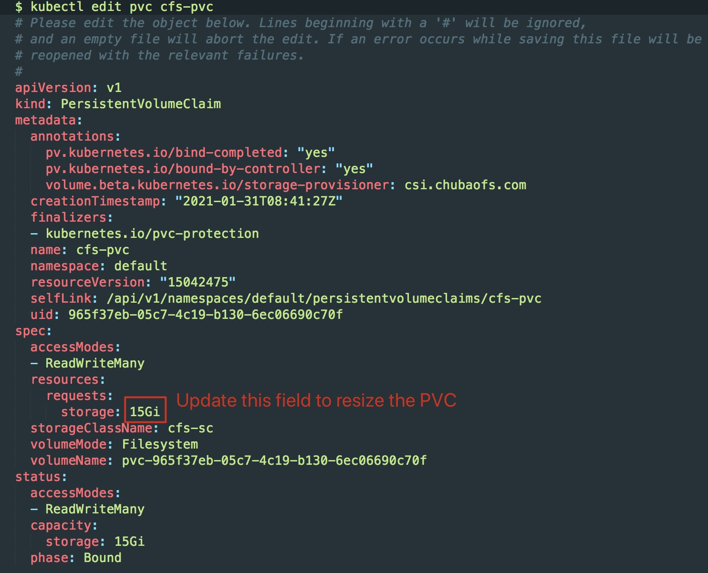

# How Volume Expansion

In Kubernetes v1.11 the persistent volume expansion feature is being promoted to beta. This feature allows users to easily resize an existing volume by editing the `PersistentVolumeClaim` (PVC) object. Users no longer have to manually interact with the storage backend or delete and recreate PV and PVC objects to increase the size of a volume. Shrinking persistent volumes is not supported.

Volume expansion was introduced in v1.8 as an Alpha feature, and versions prior to v1.11 required enabling the feature gate, `ExpandPersistentVolumes`, as well as the admission controller, `PersistentVolumeClaimResize` (which prevents expansion of PVCs whose underlying storage provider does not support resizing). In Kubernetes v1.11+, both the feature gate and admission controller are enabled by default.

Kubernetes v1.11 also introduces an alpha feature called online file system expansion. This feature enables file system expansion while a volume is still in-use by a pod. Because this feature is alpha, it requires enabling the feature gate, `ExpandInUsePersistentVolumes`. When this feature is enabled, pod referencing the resized volume do not need to be restarted. Instead, the file system will automatically be resized while in use as part of volume expansion. File system expansion does not happen until a pod references the resized volume, so if no pods referencing the volume are running file system expansion will not happen.

## Enabling Volume expansion for CSI volumes in Kubernetes

To expand a volume if permitted by the [storage class](https://kubernetes.io/docs/concepts/storage/persistent-volumes/#expanding-persistent-volumes-claims), users just need to edit the persistent volume claim object and request more storage.

In Kubernetes 1.14 and 1.15, this feature was in alpha status and required enabling the following feature gate:

```
--feature-gates=ExpandCSIVolumes=true
```

Also in Kubernetes 1.14 and 1.15, online expansion had to be enabled explicitly:

```
--feature-gates=ExpandInUsePersistentVolumes=true
```

external-resizer and kubelet add appropriate events and conditions to persistent volume claim objects indicating progress of volume expansion operations.

## Volume Expansion

ChubaoFS CSI support volume expansion. you can use it by setting the `allowVolumeExpansion` field to `true` in their `StorageClass` object(s). Only PVCs created from that `StorageClass` will be allowed to trigger volume expansion.

```yaml
$ cat deploy/storageclass.yaml
kind: StorageClass
apiVersion: storage.k8s.io/v1
metadata:
  name: cfs-sc
  namespace: default
provisioner: csi.chubaofs.com
allowVolumeExpansion: true
reclaimPolicy: Delete
parameters:
  # Resource manager IP address or URL
  masterAddr: "master-service.chubaofs.svc.cluster.local:17010"
  # Owner name as authentication
  owner: "csiuser"
```

Any PVC created from this StorageClass can be edited (as illustrated below) to request more space. Kubernetes will interpret a change to the storage field as a request for more space, and will trigger automatic volume resizing.

<div width="100%" style="text-align:center;"></div>


File system expansion must be triggered by terminating the pod using the volume. More specifically:

* Edit the PVC to request more space.
* Once underlying volume has been expanded by the storage provider, then the `PersistentVolume` object will reflect the updated size and the PVC will have the `FileSystemResizePending` condition.

You can verify this by running kubectl get pvc <pvc_name> -o yaml

```yaml
$ kubectl get pvc cfs-pvc -o yaml
apiVersion: v1
kind: PersistentVolumeClaim
metadata:
  annotations:
    pv.kubernetes.io/bind-completed: "yes"
    pv.kubernetes.io/bound-by-controller: "yes"
    volume.beta.kubernetes.io/storage-provisioner: csi.chubaofs.com
  creationTimestamp: "2021-01-31T08:41:27Z"
  finalizers:
  - kubernetes.io/pvc-protection
  name: cfs-pvc
  namespace: default
  resourceVersion: "15042475"
  selfLink: /api/v1/namespaces/default/persistentvolumeclaims/cfs-pvc
  uid: 965f37eb-05c7-4c19-b130-6ec06690c70f
spec:
  accessModes:
  - ReadWriteMany
  resources:
    requests:
      storage: 20Gi
  storageClassName: cfs-sc
  volumeMode: Filesystem
  volumeName: pvc-965f37eb-05c7-4c19-b130-6ec06690c70f
status:
  accessModes:
  - ReadWriteMany
  capacity:
    storage: 20Gi
  phase: Bound
```

* Once the PVC has the condition `FileSystemResizePending` then pod that uses the PVC can be restarted to finish file system resizing on the node. Restart can be achieved by deleting and recreating the pod or by scaling down the deployment and then scaling it up again.
* Once file system resizing is done, the PVC will automatically be updated to reflect new size.

Any errors encountered while expanding file system should be available as events on pod.


